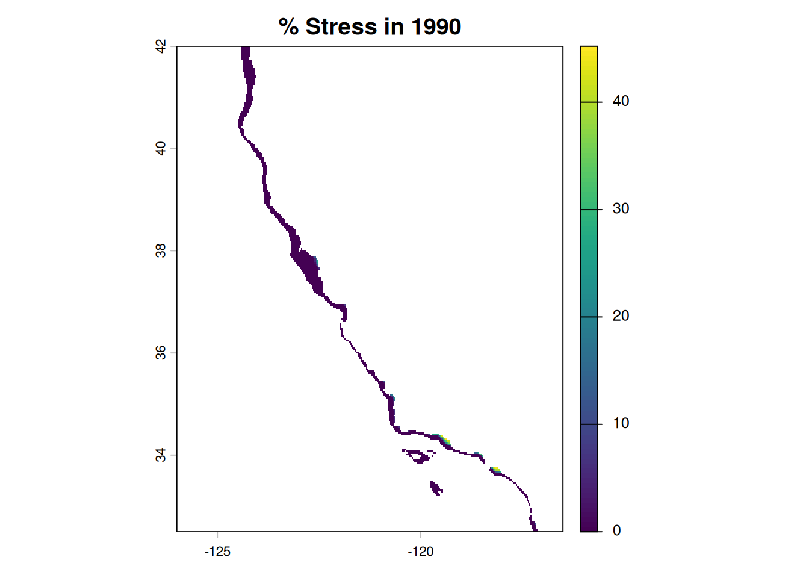
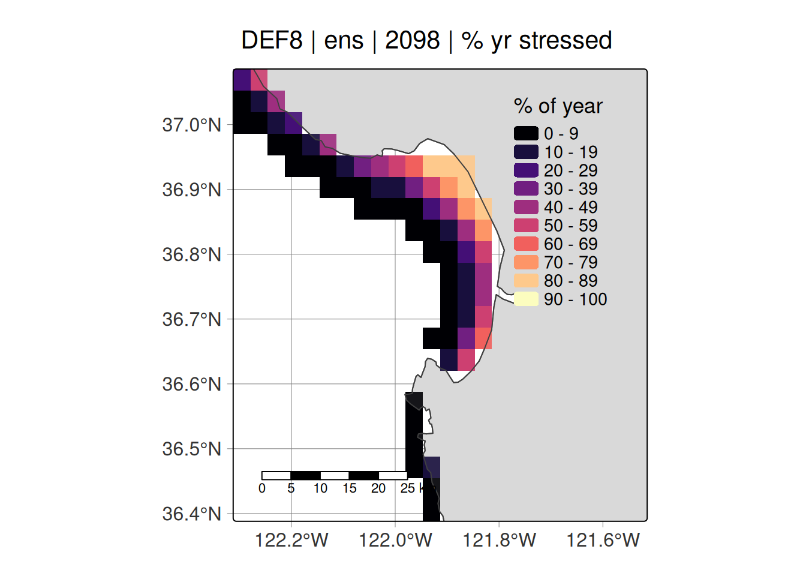
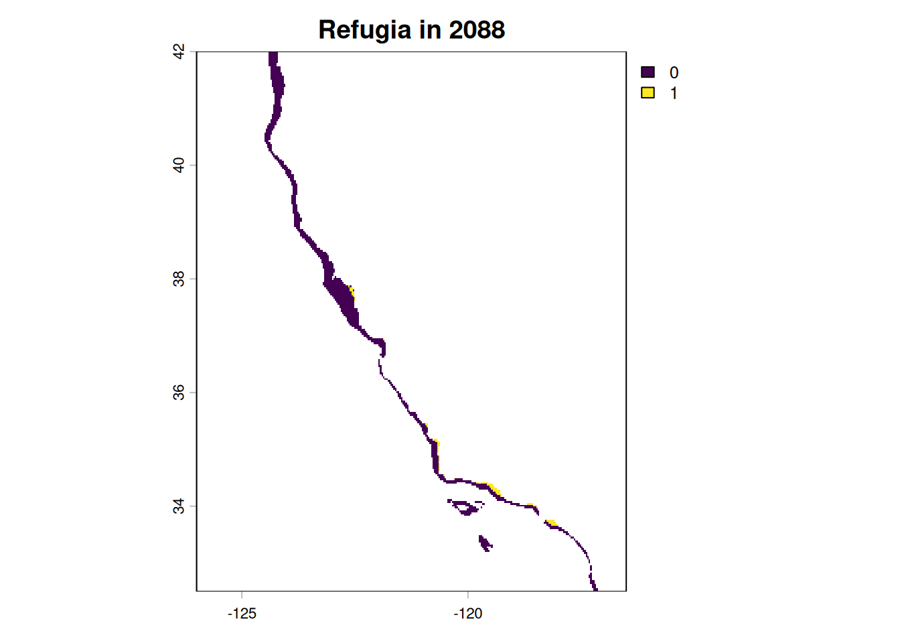
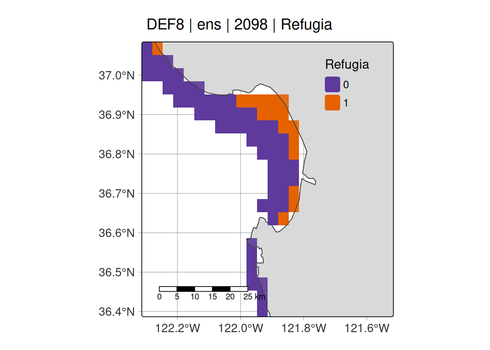
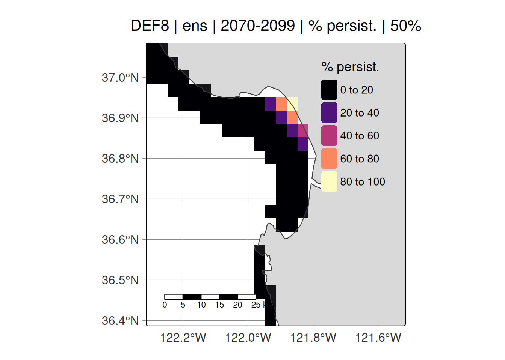
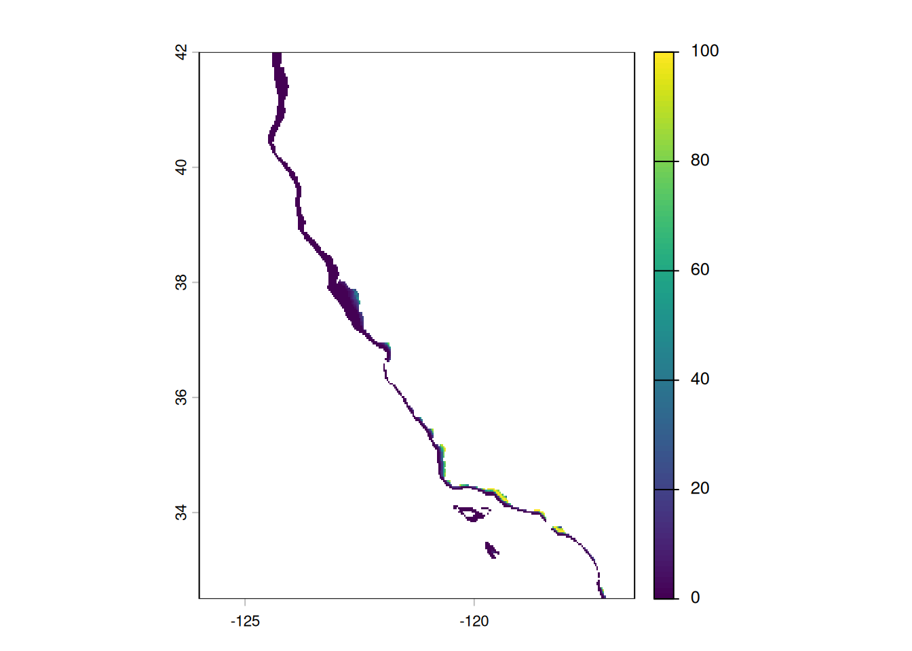
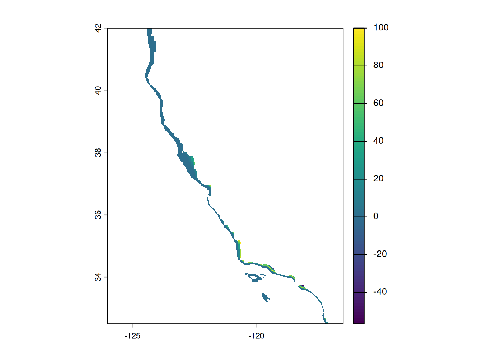
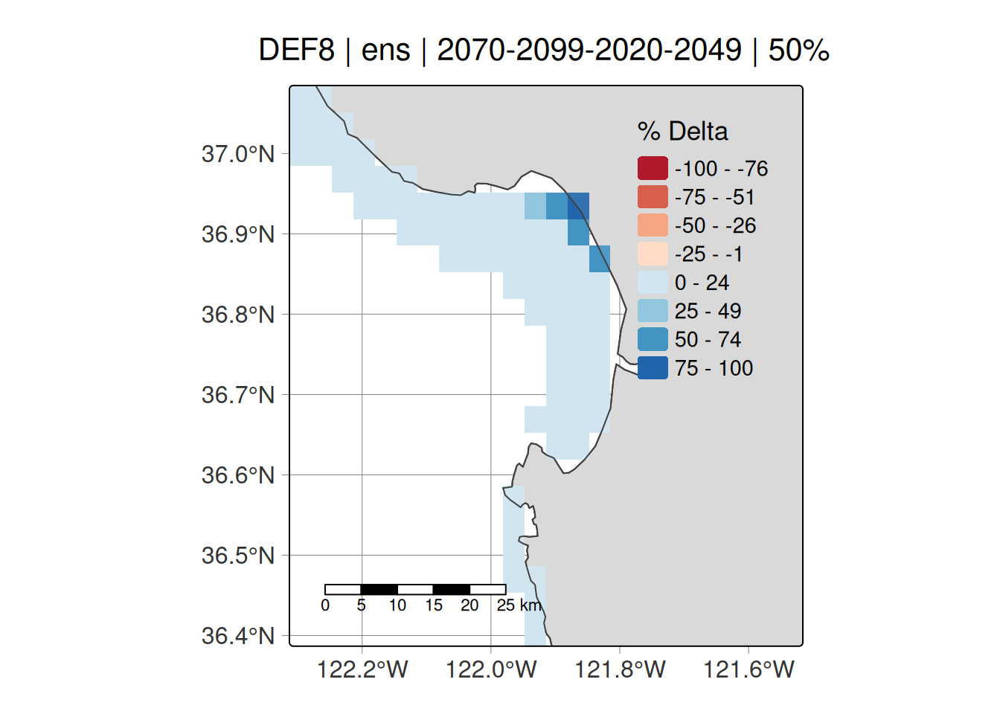

# abalone

``` r
library(abalone)
```

## Data required

### Refugia dataframe

All examples require a dataframe of annual refugia. The examples herein
use a precomputed refugia dataset contained internally within the
package, which you can access via
[`abalone::percentdays`](https://jessicabolin.github.io/abalone/reference/percentdays.md).
This represents a dataframe of refugia for each year across the three
ESMs, for definition 8: temperature growth.

- `cellID` = cell number corresponding to the cell index position from
  [`abalone::cali_rast`](https://jessicabolin.github.io/abalone/reference/cali_rast.md)
  which is a raster of California coastal cells taken from UCSC-ROMS 3
  km, but only containing grid cells above 100m depth.
- `refugiadays` = Number of days where refugia conditions are met for
  the corresponding cellID-year-model combination
- `percent` = As above, but for percent of year
- `year` = Year of interest
- `model` = Earth System Model

``` r
tail(abalone::percentdays)
#>        cellID refugiadays   percent year model
#> 697519  81489          65 17.808219 2100 hadtv
#> 697520  81490         182 49.863014 2100 hadtv
#> 697521  81491         268 73.424658 2100 hadtv
#> 697522  81775          33  9.041096 2100 hadtv
#> 697523  81776         113 30.958904 2100 hadtv
#> 697524  81777         225 61.643836 2100 hadtv
str(abalone::percentdays)
#> 'data.frame':    697524 obs. of  5 variables:
#>  $ cellID     : num  49 50 51 52 53 54 335 336 337 338 ...
#>  $ refugiadays: num  0 0 0 0 0 0 0 0 0 0 ...
#>  $ percent    : num  0 0 0 0 0 0 0 0 0 0 ...
#>  $ year       : num  1990 1990 1990 1990 1990 1990 1990 1990 1990 1990 ...
#>  $ model      : chr  "ens" "ens" "ens" "ens" ...
unique(abalone::percentdays$model)
#> [1] "ens"    "gfdltv" "ipsltv" "hadtv"
range(abalone::percentdays$year)
#> [1] 1990 2100
```

### Case study lat/lon extents

We provide extents of our case study regions via `extent_list`

``` r
extent_list
#> $monterey_bay
#>   xmin   xmax   ymin   ymax 
#> -122.3 -121.5   36.4   37.1 
#> 
#> $fort_bragg
#>   xmin   xmax   ymin   ymax 
#> -124.3 -123.5   39.1   39.7 
#> 
#> $channel_islands
#>    xmin    xmax    ymin    ymax 
#> -120.50 -119.40   33.80   34.15 
#> 
#> $san_francisco
#>   xmin   xmax   ymin   ymax 
#> -123.5 -121.9   37.3   38.5
```

### Shapefiles

We provide five shapefiles to aid in mapping via the `read_shp`
function. Datasets and further info can be found in the helpfile

## 1. Stress

### Build rasters of annual ‘stress’

First, we use `build_stress` to create rasters of annual stress. This is
defined as the percentage of each year that abalone experience stress,
based on the refugia definition chosen.

This produces a
[`terra::rast()`](https://rspatial.github.io/terra/reference/rast.html)
object of stress for each grid cell for the state of California. The
user can specify to save the output to a local directory via the
`save_path` argument - leaving it as NULL will not save the file.

``` r
ens_stress <- build_stress(percentdays = abalone::percentdays, 
                           esm = "ens", 
                           yrst = 1990, 
                           yrend = 2100,
                           progress = FALSE, 
                           save_path = NULL)

ens_stress
#> class       : SpatRaster 
#> size        : 286, 286, 111  (nrow, ncol, nlyr)
#> resolution  : 0.03321678, 0.03323263  (x, y)
#> extent      : -126, -116.5, 32.49849, 42.00302  (xmin, xmax, ymin, ymax)
#> coord. ref. : lon/lat WGS 84 (EPSG:4326) 
#> source(s)   : memory
#> varnames    : emptyrast_100 
#>               emptyrast_100 
#>               emptyrast_100 
#>               ...
#> names       :     1990,     1991,     1992,     1993,    1994,     1995, ... 
#> min values  :  0.00000,  0.00000,  0.00000,  0.00000,  0.0000,  0.00000, ... 
#> max values  : 45.20548, 48.49315, 55.19126, 52.05479, 46.0274, 59.72603, ...
```

Above, the resolution is 3km, extent is for California, and the file has
111 layers, corresponding to 111 years between the user-specified year
range in the function call.

Now, we can vizualise what one layer of the raster looks like.

``` r
terra::plot(ens_stress[[1]], main = "% Stress in 1990")
```



### Vizualise annual stress using `tmap`

Now we can use `viz_stress` to create a `tmap` map of a particular
location of interest. Let’s have a look at projected stress for Monterey
Bay and Fort Bragg in 2098, ensembled across all ESMs.

``` r
stress_ci <- viz_stress(yr = 2098, 
                        esm = "ens", 
                        area = "monterey_bay", 
                        def = "def8", 
                        extent_list = abalone::extent_list,
                        infile = abalone::percentdays)

stress_ci
```



### Plot annual time series of refugia

Now we can vizualise the % of each year that meet refugia conditions.
Note this takes ~5 seconds for Jessie to run.

``` r
ts_viz_percentdays(area = "monterey_bay", 
                   yr_range = 1990:2100, 
                   def = "def8",
                   input_file = abalone::percentdays, 
                   cons_thresh = 95, 
                   lib_thresh = 50)
#> Warning: Using `size` aesthetic for lines was deprecated in ggplot2 3.4.0.
#> ℹ Please use `linewidth` instead.
#> ℹ The deprecated feature was likely used in the abalone package.
#>   Please report the issue at <https://github.com/JessicaBolin/abalone/issues>.
```


## 2. Refugia

### Build rasters of binary refugia

Now that we have rasters of stress, we can convert these into binary
rasters of refugia using the `build_refugia` function. We have a new
argument for `thresh`, representing the temporal threshold we use to
define refugia. The two options we provide are either 50 or 95%,
representing liberal and conservative thresholds for defining refugia
for the year of interest.

``` r
ens_refugia <- build_refugia(percentdays = abalone::percentdays,
                             esm = "ens", 
                             yrst = 1990, 
                             yrend = 2100, 
                             persist_thresh = 50, 
                             progress = FALSE, 
                             save_path = NULL)
terra::plot(ens_refugia[[98]], main = "Refugia in 2088")
```



### Vizualise binary refugia

And as before, we can vizulise our refugia rasters using `viz_refugia`:

``` r
viz_refugia(yr = 2098, 
            esm = "ens", 
            area = "monterey_bay",
            def = "def8", 
            extent_list = abalone::extent_list, 
            infile = abalone::percentdays, 
            persist_thresh = 50)
```



### Plot annual time series of refugia (temporal threshold)

Here, we can see the proportion of each year refugia conditions were
met, averaged across all cells within the area of interest. This is
dependent on the temporal threshold used. Takes a few seconds to run.

``` r
ts_viz_refugia(area = "monterey_bay", 
               yr_range = 1990:2100, 
               def = "def8",
               input_file = abalone::percentdays, 
               persist_thresh = 50, 
               extent_list = abalone::extent_list)
```



## 3. Persistence

### Build rasters of persistence of refugia

Now that we have our binary refugia maps, we want to calculate the
persistence of refugia over a predefined time period. Here, we can
create a raster of persistence for 2070-2099, which tells us the % of
time during this time period that each cell was classed as refugia,
dependent on the temporal threshold used.

``` r
persist_refugia <- build_persist(esm = "ens", 
                                 yr_range = 2070:2099,
                                 persist_thresh = 50, 
                                 save_path = NULL)
terra::plot(persist_refugia)
```



### Vizualise persistence

As before, we can use `tmap` to create a nicer plot.

``` r
viz_persist(yr = 2070:2099, 
            esm = "ens", 
            area = "monterey_bay",
            def = "def8", 
            extent_list = abalone::extent_list, 
            breaks = seq(0, 100, 20), 
            persist_thresh = 50)
```


## 4. Delta

### Build rasters of delta refugia

We’re interested in how refugia has changed over time. The function
`build_delta` creates a raster in delta refugia (i.e., the change in
refugia) between two time periods. Positive values = gain in refugia;
negative values = loss of refugia.

``` r
deltar <- build_delta(persist_thresh = 50, 
                      esm = "ens", 
                      hist_range = 2020:2049, 
                      proj_range = 2070:2099, 
                      save_path = NULL)
terra::plot(deltar)
```



### Vizualise delta

Let’s use `tmap`.

``` r
viz_delta(esm = "ens",
          area = "monterey_bay",
          def = "def8", 
          hist_range = 2020:2049, 
          proj_range = 2070:2099,
          extent_list = abalone::extent_list, 
          persist_thresh = 50, 
          save_path = NULL)
```


